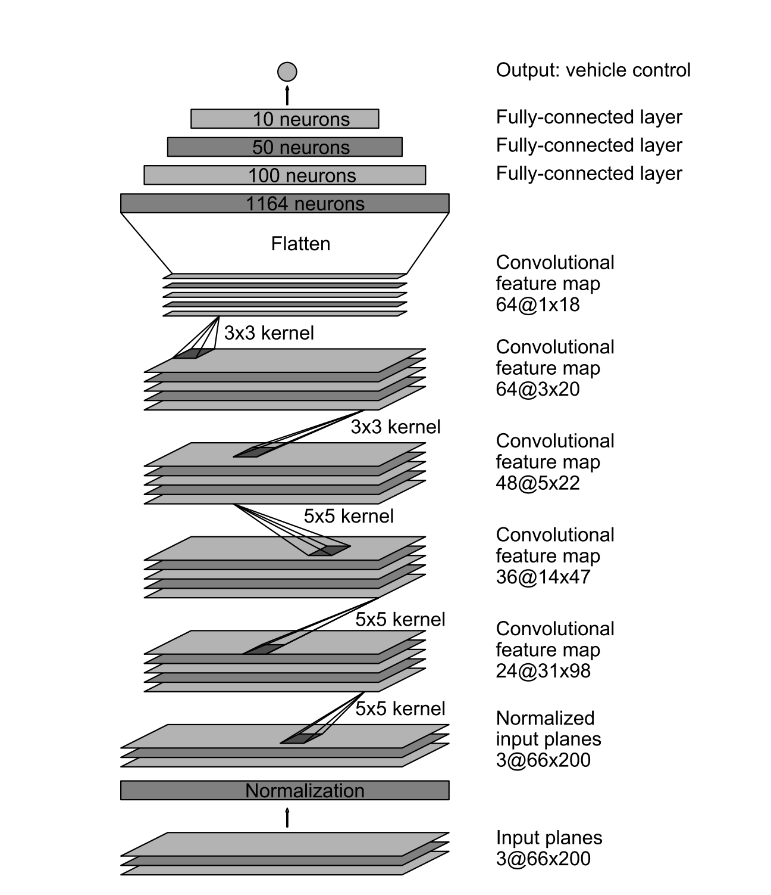
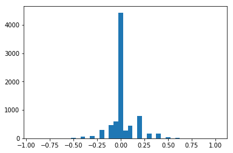
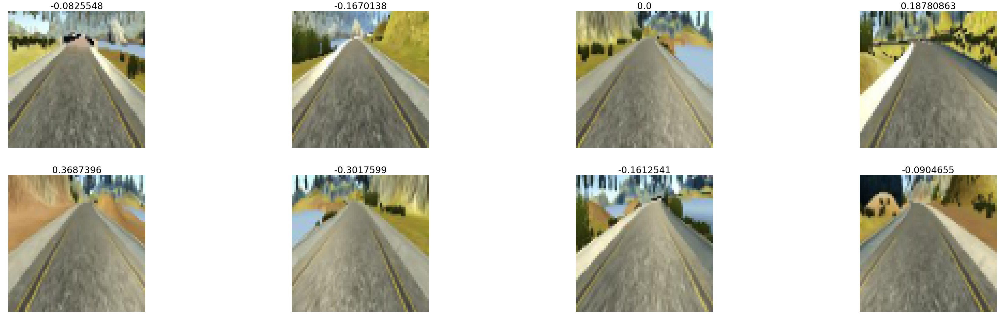

# Behavrioal Cloning Project

The goals / steps of this project are the following:
* Use the simulator to collect data of good driving behavior
* Build, a convolution neural network in Keras that predicts steering angles from images
* Train and validate the model with a training and validation set
* Test that the model successfully drives around track one without leaving the road
* Summarize the results with a written report

## Files Submitted

###  Files explaination

My project includes the following files:
* model.py containing the script to create and train the model
* drive.py for driving the car in autonomous mode
* model.json and model.h5 containing a trained convolution neural network 
* writeup_report.md or writeup_report.pdf summarizing the results

### Run the car automatically
Using the Udacity provided simulator and my drive.py file, the car can be driven autonomously around the track by executing 
```sh
python drive.py model.json
```

## Model Architecture and Training Strategy

### Model architecture

I implemented the same model in the [NVIDIA paper](https://images.nvidia.com/content/tegra/automotive/images/2016/solutions/pdf/end-to-end-dl-using-px.pdf) shown below. 

This model is composed of 5 convolutional layers followed by 4 fully connected layers. The parameters such as size of each layer are shown on on the figure. 

I used RELU as the activation function for each layer. Also, for each convolutional layer, I used 2*2 MaxPooling.

Two dropout layers with keep_prob=0.5 were added to two convolutional layers to avoid overfitting.
### Training
The model used an adam optimizer, so the **learning rate** was not tuned manually.

I didn't take the train/validation split approach, but rather **generate train/validation data sets randomly** each time based on an advanced random data picking strategy discussed later.  Because the train/validation data is selected randomly each time, this approach is still valid. I used several augmentation techniques when generating the training data while only the original data was used for validation. The data augmentation and selection will be discussed later in this report.

Before training, the program will first try to look for the weights that were saved before. If it finds previously saved weights, it will initialize the model with the saved weights and then train from there. This way previous training efforts can be saved and resumed any time.

I trained the model with 8 epochs with training batch size 128. 150*128 samples are used each epoch.

## Data Processing Techniques

### Data Selection
I used the data set provided by Udacity direcly since I found it hard to generate good training samples without a joystick.
#### Remove noises 
As a first step, I removed data that has speed < 3. The reason behind that is if speed is too small, even a wrong steering angle won't result in a bad car position immediately. Therefore data with low speed is treated as noise (even though it may be good data).
#### Deal with unbanlanced data: advanced random data picking
The following code plots # samples vs. steering angle. We can clearly see that the data set is extremely unbalanced, i.e.,  most data is sampled when the car is moving straight (steering = 0). This isn't good news for training a neural network. If we use the data set directly, the model is biased to moving straight and will lose the ability to turn the car correcly. 

I used a **random sample from random bin** approach to select the training data. This approach is implemented in ```pick_data()``` method in ```model.py```. The steps to generate a random datapoint is:
1. Divide the steering angle range (-1, 1) into several bins, e.g., (-1, -0.5), (-0.5, 0), (0,0.5) and (0.5,1). 
2. Randomly select a bin. 
3. Randomly select a sample from the random bin.
By configuring the bins, we can control how many datapoints we want to select from each bin and therefore the unbalanced data problem is solved. The bins that I picked are [-1,-0.5, -0.2,-0.1, 0,  0.1, 0.2, 0.5, 1]. This helped to distribute training data much better. Note that I did not pick evenly distributed steering bins.  There are not enough data points in the large steering angle range and if make the large steering angle bins same size as small steering angle bins, we may end up with overfitting the large steering angle data.


```python
bins=[-1,-0.9,-0.8,-0.7,-0.6,-0.5,-0.4,-0.3,-0.2,-0.1, -0.05, 0, 0.05,  0.1, 0.2,0.3,0.4,0.5,0.6,0.7,0.8,0.9,1]
categories = pd.cut(data['steering'], bins, labels=bins[1:])
unique, unique_counts = np.unique(categories, return_counts=True)
plt.bar(unique,unique_counts, 0.05)
```


    <Container object of 21 artists>





### Data augmentation
#### Use left/right cameras
A correction of 0.24/-0.24 was added to the left/right camera images to generate more training data. This is reflected in the ```preprocess_image_file_train()``` method in ```model.py```.
#### Random flip images
For each picked training image, I randomly flip it (also with inversed steering) to simulate a reverse direction driving. This is also reflected in the ```preprocess_image_file_train()``` method in ```model.py```.
### Image preprocessing
** Crop ** The top and bottom part of the image can be noises for our training. Therefore, the 50 pixels on top and 40 pixels from the bottom are removed. The original image size is 
320*160, after cropping, the size becomes 320*70.

** Resize ** Images are resized to 64*64 to reduce the training time. 64*64 is good enough to capture the useful features. The cropping and resize processing are done in the ```crop_and_reshape()``` method in ```model.py```.

** Normalize** Images are converted to (-1.0, 1.0) ranges. This is done by a Keras Lambda function.

### Put everything together - data negerators
* **Training data generator =  Data picking + Augmentation + Preprocessing**
* **Validation data generator = Data picking + Preprocessing**

Following code shows an example of calling the generator to generate 8 training images.


```python
images, steerings = next(batch_generate_images(data,preprocess_image_file_train, 8))
plt.figure(figsize=(64,48))
for i in range(len(steerings)):
    plt.subplot(5,4,i+1)
    plt.imshow(np.uint8(images[i]))
    plt.axis('off')
    plt.title(steerings[i],fontsize=30)
```





## Driving the Car

```drive.py``` loads the previously saved model and predict steerings. Here are some interesting points in ```drive.py```:

* **Preprocessing images**: Because we train the network with preprocessed images, we need to feed into the model with preprocessed images to predict.

* **Low pass filter**: In order to compensate some prediction errors to make the car drive more smoothly, a simple low pass filter was implemented. It basically does a weighted average on the current steering and several most recent predictions so that the car does not turn sharply.

## Summary and Future Work
This is the most challenging yet rewarding project I have done so far. I spent so much time on training as well as learning python, numpy, opencv, keras, etc. Everything is new to me and I am excited that at the end I was able to drive the car using my model!

I don't have enough time to try all my ideas and here is a list of future work that I think can be done to improve the project:
* Collect data from track 2 and train the model and drive the car on track 2.
* This project only predicts steering data. To make the model more sophisticated, more data such as speed, brake can also be trained.
* Further more, if we can collect data in real driving conditions, the model can be trained to deal with more complicated scenarios such as stop before a STOP sign.